

# Данил Шевнин

**Fullstack / Backend-разработчик** · 6 лет опыта · 24 года

 

 

[EN](README.md) · **RU**

 

📧 [todd.develop@gmail.com](mailto:todd.develop@gmail.com) · [developer2033@yandex.ru](mailto:developer2033@yandex.ru)  
📱 [+7 988 364-08-61](tel:+79883640861) · [+7 978 972-23-00](tel:+79789722300)

---

## 👋 Обо мне

Fullstack-разработчик, **6 лет опыта**, 24 года. Есть водительские права. Основные языки — **Go** и **Python**, также React / TypeScript и Rust. Делаю продукты от идеи до запуска: backend, интерфейс, инфраструктура, деплой.

Сильные стороны: микросервисы, системы в реальном времени, отказоустойчивая инфраструктура, Telegram-боты и Mini Apps, AI-интеграции, платежи, DeFi на TON, десктоп-приложения (Tauri / Electron), перевод речь-в-речь и перевод на **жестовый язык**.

Активный сотрудник: сам предлагаю улучшения, согласовываю с руководством и довожу внедрение до результата. Умею работать и в команде, и самостоятельно.

---

## 💡 Личные качества

- **Пунктуальность** — сдаю работу в срок, умею работать с дедлайнами
- **Ответственность** — беру сложные задачи на себя и довожу до конца; о рисках говорю заранее
- **Инициативность** — предлагаю улучшения, после согласования организую и реализую сам
- **Многозадачность** — веду несколько проектов параллельно без потери качества
- **Самостоятельность** — сам планирую работу и приоритеты, не требую постоянного контроля
- **Быстрое обучение** — быстро осваиваю новые технологии, когда это нужно продукту
- **Коммуникация** — понятно объясняю решения коллегам и руководству

---

## 🛠 Навыки

#### Backend
Go (Gin, Echo) · Python (Django, Django Ninja, FastAPI, aiogram) · gRPC (streaming) · REST · WebSocket · JWT · 2FA / TOTP · protobuf · Swagger · Celery · Celery Beat

#### Базы данных и кэш
PostgreSQL · **PostgreSQL HA (Patroni + etcd + HAProxy + PgBouncer)** · replication · RO/RW split · Redis · Redis Sentinel · ClickHouse · Bun · GORM · pgx · SQL-миграции (goose)

#### Real-time и стриминг
WebRTC · WebSocket · NATS · HTTP/3 · QUIC · WebTransport · брокеры сообщений

#### Desktop и нативное аудио
Rust (cpal, WASAPI, tokio, serde, **Axum**, **SQLx**) · **Tauri 2** · Electron · N-API · Android · real-time аудио (захват PCM, ресемплинг, loopback / виртуальные аудиоустройства, PulseAudio/pactl) · бесшовное видеовоспроизведение

#### Frontend
React · Next.js · TypeScript · Vite · Tailwind CSS · TanStack Query / Table · Telegram Mini Apps · Chrome Extensions

#### AI и медиа-генерация
[OpenAI](https://openai.com/) · [Deepgram](https://deepgram.com/) (STT/TTS) · [Google Gemini](https://ai.google.dev/) / Gemini Live (глосс, real-time STT + перевод + TTS) · [ElevenLabs](https://elevenlabs.io/) (TTS/STT) · Edge TTS · [fal.ai](https://fal.ai/) · [kie.ai](https://kie.ai/) · LLM · генерация изображений / видео / аудио · **RIFE** / FFmpeg видео-пайплайны

#### Blockchain и DeFi
[TON](https://ton.org/) · DEX-агрегаторы · индексер блокчейна · маршрутизация свопов · multi-hop пути · Jettons · TON Connect

#### Платежи и Web3
Stripe · Robokassa · [Privy](https://www.privy.io/) · Plaid · Solana · webhooks

#### Мессенджеры
Telegram Bot API · Telegram Mini Apps

#### DevOps и observability
Docker · Docker Compose · **Docker Swarm** · **Ansible** · **GlusterFS** · Nginx · nginx-proxy / acme-companion · Let's Encrypt · GitHub Actions (self-hosted runners) · private Docker registry · zero-downtime deployments · Prometheus · **VictoriaMetrics** · **VictoriaLogs** · **Vector** · **Grafana** · **Alertmanager** · node-exporter · cAdvisor · structured logging

#### Другое
Git · Linux · мультирегиональные / отказоустойчивые системы · парсинг данных (PDF, Excel) · i18n

---

## 💼 Опыт

### Backend / Infrastructure-разработчик — [VNISH Monitoring](https://vnish-monitoring.com/)
`03.2025 — настоящее время`

Мультирегиональная платформа мониторинга ASIC-майнеров на прошивке VNISH: real-time-телеметрия, алерты, групповые операции, Telegram Mini App и собственная отказоустойчивая инфраструктура.

<table>
  <tr>
    <td width="50%">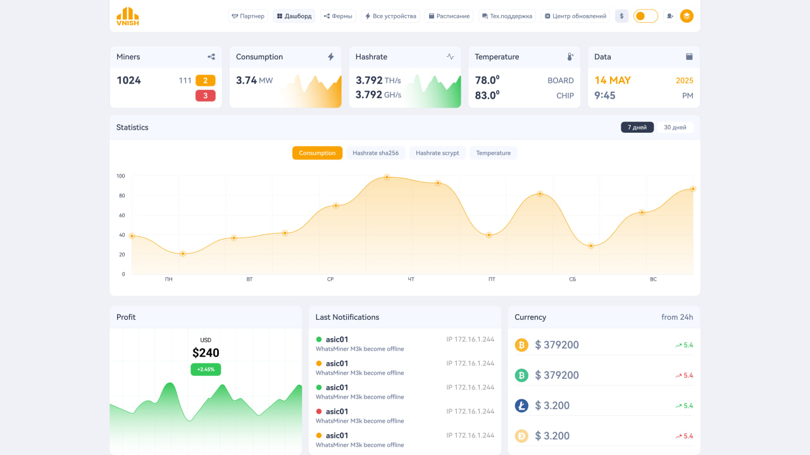</td>
    <td width="50%">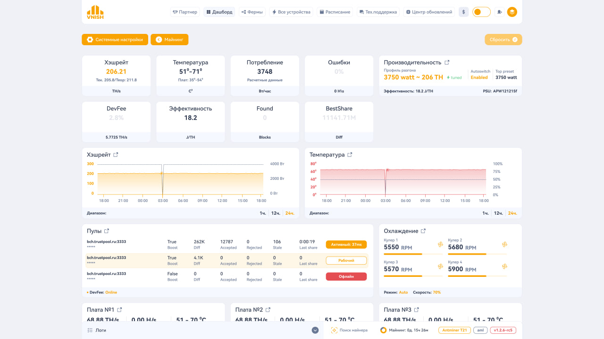</td>
  </tr>
  <tr>
    <td width="50%">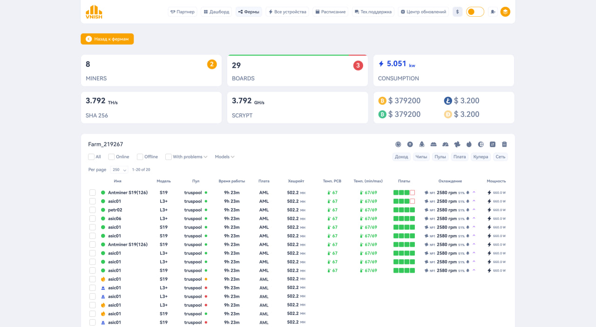</td>
    <td width="50%">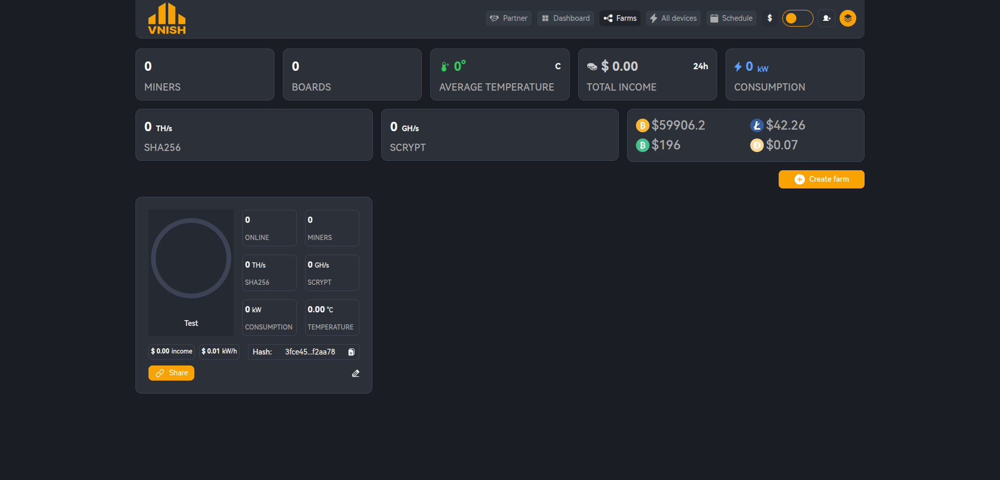</td>
  </tr>
</table>

**Backend и продукт:**
- Go-backend: **gRPC streaming** для агентов + REST API (**Echo**) для приёма и отдачи телеметрии; Bun / pgx, JWT, **2FA (TOTP)**, миграции goose, Swagger
- Сбор и агрегация метрик в реальном времени (хешрейт, температура, кулеры, энергопотребление) + **микробатчинг** записи статусов (in-memory-коалесинг по MAC → bulk INSERT), чтобы запись не блокировала горячий путь
- Система **алертинга и Telegram-уведомлений** об аномалиях + email через собственный почтовый сервер
- **Telegram Mini App** на React 19 / TypeScript / Vite / Tailwind / TanStack Query: дашборды, групповые операции над фермами, i18n
- **Agentless-мониторинг** через прошивку VNISH + собственный агент (бинарь собирается под партнёра через ldflags)
- **Мультирегиональный mesh**: кросс-доменный доступ к ASIC через Redis presence + федерацию пиров по gRPC

**Инфраструктура (спроектировал и развернул с нуля):**
- Кластер **Docker Swarm** на 7 нод в 3 регионах (COM/RU/US), размещение по сайтам, **zero-downtime** rolling-обновления (start-first)
- **PostgreSQL HA**: Patroni + etcd + HAProxy + PgBouncer на каждой ноде, RO/RW-сплит (чтение с реплик), двойной режим **кластер ↔ single-master** и авто-промоут при изоляции сайта (`site-warden`)
- **GlusterFS** — общее хранилище (бинари агентов, сертификаты, конфиги) на всех нодах
- **Observability**: VictoriaMetrics + vmagent + VictoriaLogs + Vector + Grafana + vmalert + Alertmanager (по нодам, gossip HA), node-exporter / cAdvisor / postgres / redis exporters
- **Edge**: nginx-proxy + acme-companion (Let's Encrypt) + внутренний per-node nginx (gRPC/HTTP-роутинг)
- **CI/CD**: GitHub Actions + self-hosted runners на manager-ноде, приватный Docker registry, автосборка образов и выкатка сервисов
- Полный **bootstrap кластера через Ansible** (prereqs → Swarm → secrets → stack → edge)

**Результат:** отказоустойчивая мультирегиональная платформа мониторинга майнинг-ферм с real-time-дашбордом, алертами, групповыми операциями и полностью автоматизированным развёртыванием инфраструктуры.

`Go` · `Echo` · `gRPC` · `WebSocket` · `Bun` · `pgx` · `PostgreSQL (Patroni/etcd/HAProxy/PgBouncer)` · `Redis` · `React` · `TypeScript` · `Docker Swarm` · `GlusterFS` · `Ansible` · `VictoriaMetrics` · `VictoriaLogs` · `Grafana` · `Alertmanager` · `Nginx` · `Let's Encrypt` · `GitHub Actions`

---

### Fullstack-разработчик — [Signvano](https://sgvno.com)
`08.2025 — настоящее время`

Платформа real-time видеостриминга и генерации контента (жестовый язык, AI-аватары).

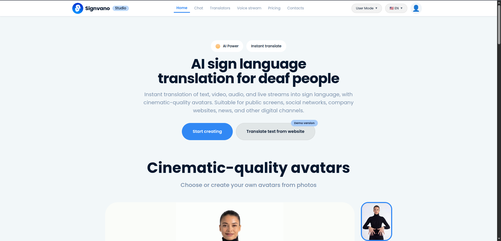

<table>
  <tr>
    <td width="50%">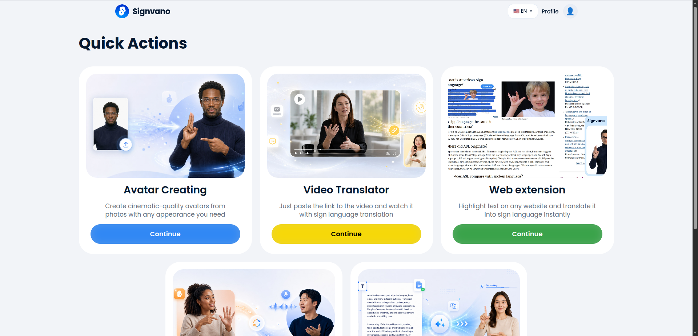</td>
    <td width="50%">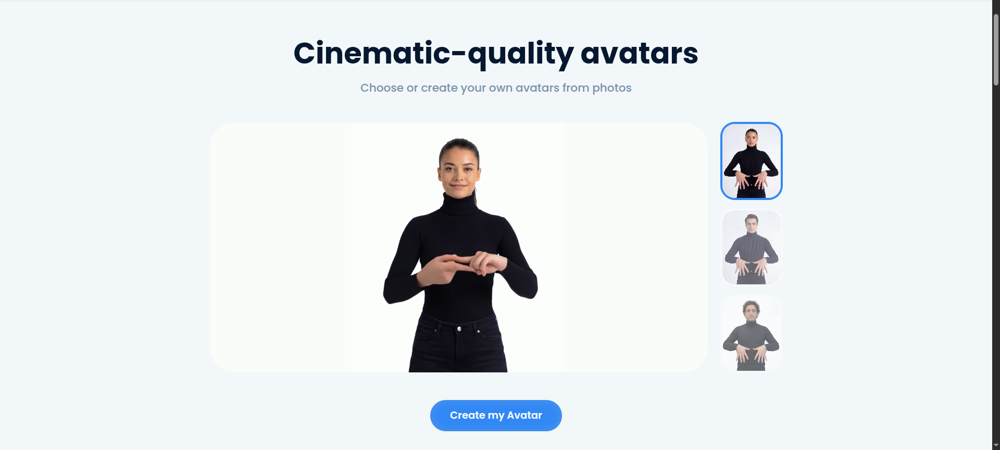</td>
  </tr>
  <tr>
    <td width="50%">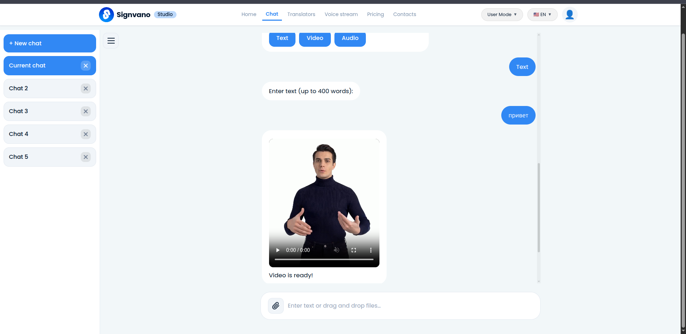</td>
    <td width="50%">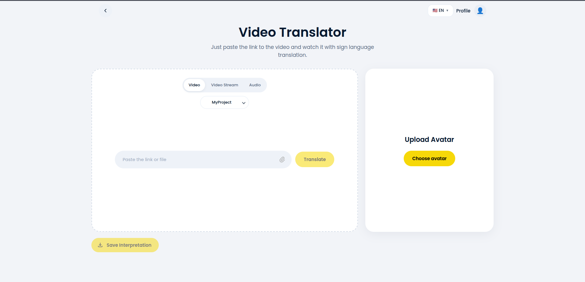</td>
  </tr>
  <tr>
    <td width="50%">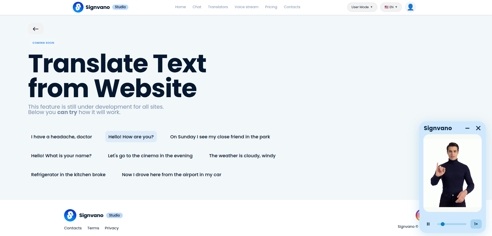</td>
    <td width="50%">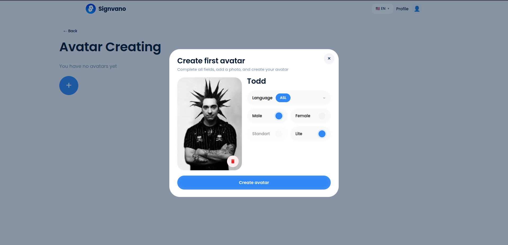</td>
  </tr>
</table>

**Что сделал:**
- Спроектировал распределённую архитектуру: **API Gateway** (Go) + отдельные **стриминговые серверы** с service discovery и балансировкой по gRPC
- Построил видеопайплайн: WebSocket / **HTTP/3 + QUIC (WebTransport)** → WebRTC SFU → **NATS** → GPU-клиенты по gRPC
- Сделал абстракцию **очереди задач** (PostgreSQL / Redis) для генерации контента без изменения кода
- Интегрировал биллинг **Stripe**: подписки, checkout, вебхуки
- Сделал React-**админку**: CRUD, аналитика, мониторинг стриминговых сервисов
- Настроил **CI/CD** (GitHub Actions): автодеплой стриминговых нод на несколько серверов

**Результат:** production-готовая платформа с горизонтальным масштабированием стриминга, монетизацией и автоматизированным развёртыванием инфраструктуры.

`Go` · `gRPC` · `PostgreSQL` · `Redis` · `NATS` · `WebRTC` · `HTTP/3` · `React` · `TypeScript` · `Docker` · `GitHub Actions`

---

### Fullstack-разработчик — LiveVoice · пет-проект
`06.2026 — настоящее время`

Кроссплатформенное десктоп-приложение для **real-time двунаправленного голосового перевода** в видеозвонках (например, Google Meet): речь собеседника переводится в наушники, а ваша речь — в виртуальный микрофон, вживую.

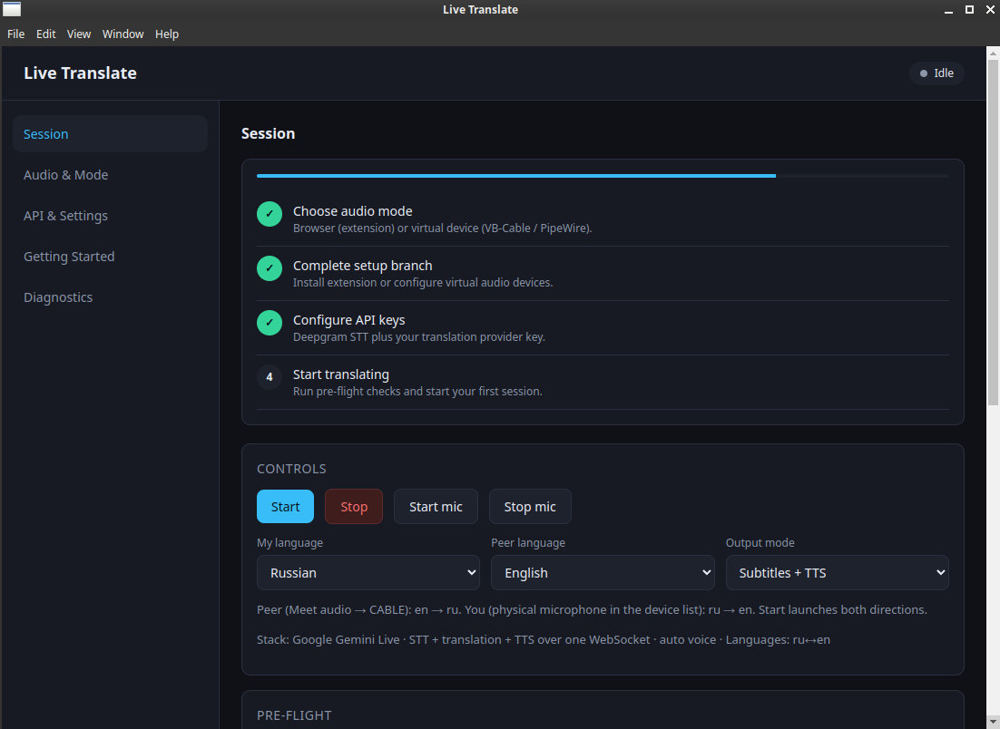

**Что сделал:**
- Построил низколатентный пайплайн **захват аудио → STT → перевод → TTS** в обе стороны (incoming: собеседник → наушники; outgoing: микрофон → виртуальный микрофон)
- Написал нативный **аудиодвижок на Rust** (cpal, **WASAPI loopback** на Windows, маршрутизация **PulseAudio / pactl** null-sink на Linux, ресемплинг через rubato), подключённый к Node через **N-API**
- Интегрировал нескольких AI-провайдеров: **Deepgram** (live STT, TTS, перевод Agent «think» по WebSocket), **Google Gemini Live** (STT + перевод + TTS в одном WebSocket), **Kie**, **Edge TTS**
- Реализовал **echo guard** (защита от повторного захвата и перевода собственного TTS), **кэш TTS** и маршрутизацию **виртуального микрофона** (VB-Cable / null-sink)
- Сделал **Chrome-расширение** и десктоп-UI (дашборд) поверх общего WebSocket-протокола (TypeScript + Zod)
- Веду полную **миграцию с Electron + Node на Tauri 2** с полностью Rust-бэкендом (один процесс, передача PCM внутри процесса, без внутренней сети)

**Результат:** рабочий инструмент перевода речь-в-речь для живых звонков с нативным кроссплатформенным аудиостеком и сменными STT/TTS/перевод-провайдерами.

`Rust` · `cpal` · `WASAPI` · `Tauri` · `Electron` · `Node.js` · `TypeScript` · `Zod` · `WebSocket` · `Deepgram` · `Google Gemini Live` · `Edge TTS` · `Chrome Extension`

---

### Fullstack-разработчик — [SignSync](https://signsync.go-rshok.ru/) · пет-проект
`06.2026 — настоящее время`

Кроссплатформенный переводчик на **русский жестовый язык (РЖЯ)**: речь или текст → глосс → бесшовное видео аватара. Desktop (Windows/Linux), Android, продуктовый лендинг и Rust-бэкенд для auth, кредитов, STT-прокси и защищённой раздачи клипов.

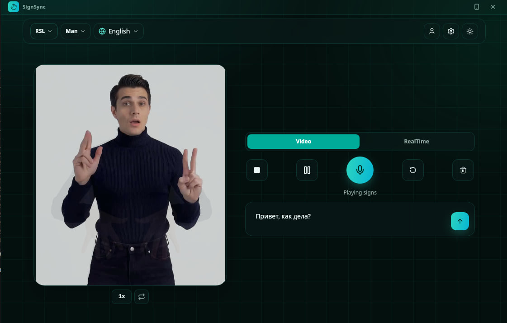

<table>
  <tr>
    <td width="68%">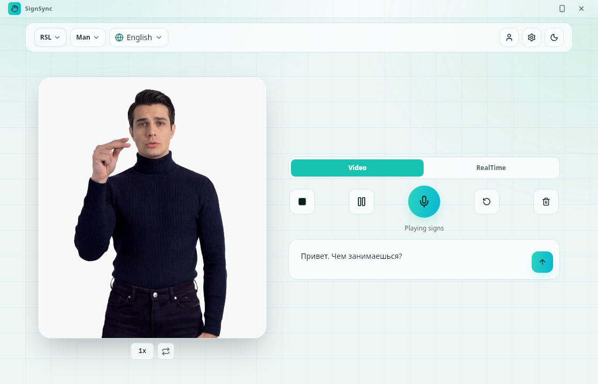</td>
    <td width="32%">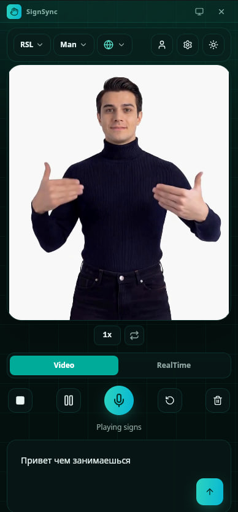</td>
  </tr>
</table>

**Что сделал:**
- Построил end-to-end пайплайн **микрофон / текст → STT → Gemini-глосс (РЖЯ) → плейлист бесшовных клипов** с batch- и **realtime**-режимами
- Выпустил приложение на **Tauri 2** (React 19 / TypeScript / Vite / Tailwind + Rust): нативный захват аудио через **cpal**, ключи провайдеров в Stronghold, двуслойный **seamless video player** (crossfade, REST morph trim, нюансы Android WebView)
- Написал **Rust API (Axum + SQLx + PostgreSQL)**: Telegram-логин (deeplink + webhook), JWT, пользователи / **credits** / **api_key**, STT-прокси (**Deepgram** / **ElevenLabs**, HTTP + WebSocket), каталог релизов и скачиваний
- Сделал React-лендинг с **Telegram QR / deeplink-авторизацией**, личным кабинетом (API-ключ, кредиты) и сеткой загрузок под несколько платформ (AppImage, Windows, Android)
- Спроектировал GPU-видео-пайплайн (**RIFE** + FFmpeg): нормализация каждого клипа так, чтобы он начинался и заканчивался в одной REST-позе для стыковки без рывков; video-manifest + nginx **`auth_request`** для защиты `/clips/`
- Инфраструктура и CI: Docker Compose (backend, landing, nginx, Postgres), edge TLS, сборки **GitHub Actions** для Linux / Windows / Android

**Результат:** рабочий продукт перевода на РЖЯ с кроссплатформенными клиентами, аккаунтами через Telegram, хуками монетизации (кредиты / API-ключ), защищённой раздачей медиа и автоматизированными десктоп/мобильными релизами.

`Rust` · `Axum` · `SQLx` · `PostgreSQL` · `Tauri 2` · `React` · `TypeScript` · `Vite` · `Tailwind` · `cpal` · `WebSocket` · `Deepgram` · `ElevenLabs` · `Google Gemini` · `Telegram Auth` · `Nginx` · `RIFE` · `Docker` · `GitHub Actions`

---

### Fullstack-разработчик — [SvetlanaBot](https://t.me/svetlanapsyybot)
`03.2026 — настоящее время`

AI-психотерапевт в Telegram: чат с LLM, Mini App, подписки, генерация контента.

<table>
  <tr>
    <td width="42%">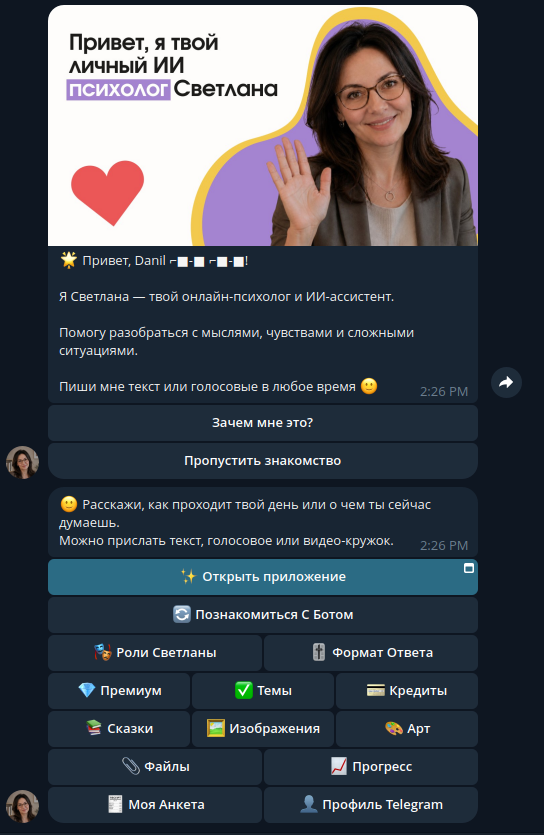</td>
    <td width="58%">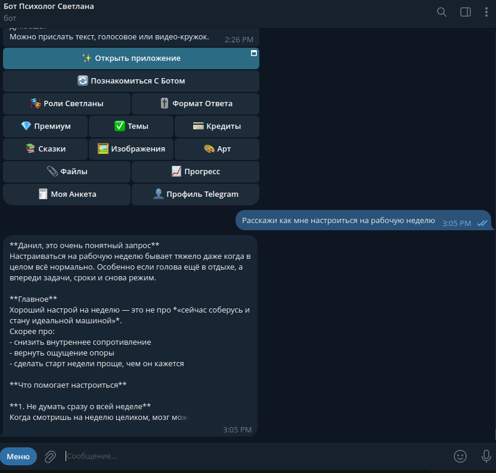</td>
  </tr>
</table>

**Что сделал:**
- Go-backend: Telegram webhook, REST API, **WebSocket-чат** со стримингом ответов LLM
- **Telegram Mini App** на React: чат, онбординг, премиум, файлы, голосовые сообщения
- Интеграции: **OpenAI**, **ElevenLabs** (TTS/STT), **fal.ai** / **kie.ai** (изображения)
- Биллинг **Robokassa**: подписки, рекуррентные платежи, система кредитов, персональные платёжные ссылки
- Система **массовых рассылок** с rate limiting и backoff под лимиты Telegram API
- **Observability**: Prometheus + Grafana (App, Postgres, Redis, Docker)

**Результат:** коммерческий AI-продукт с монетизацией, real-time-чатом и полным путём от онбординга до премиум-подписки.

`Go` · `PostgreSQL` · `Redis` · `React` · `TypeScript` · `Docker` · `Prometheus` · `Grafana`

---

### Backend-разработчик — [RPine](https://rpine.xyz/)
`2023 — настоящее время`

Стартап в экосистеме **TON**: умный **DEX-агрегатор**, который находит лучшие курсы на децентрализованных биржах, строит оптимальный маршрут свопа и даёт прозрачные комиссии без скрытых наценок ([rpine.xyz](https://rpine.xyz/)).

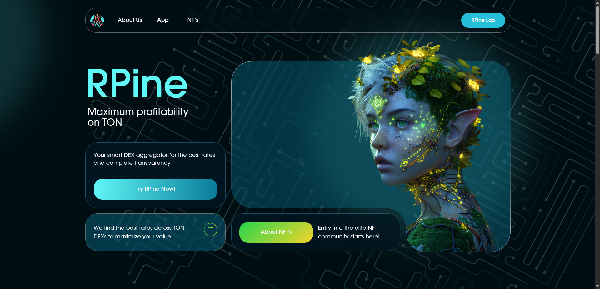

<table>
  <tr>
    <td width="68%">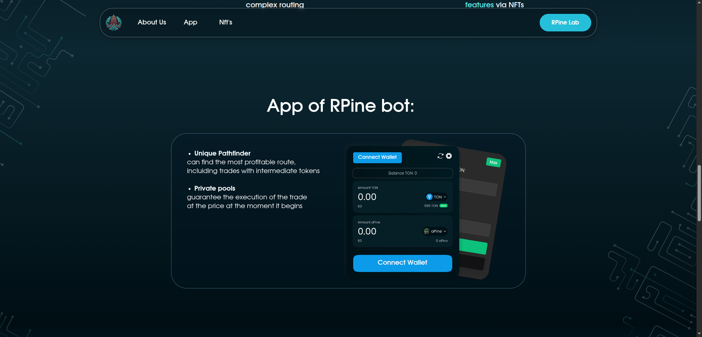</td>
    <td width="32%">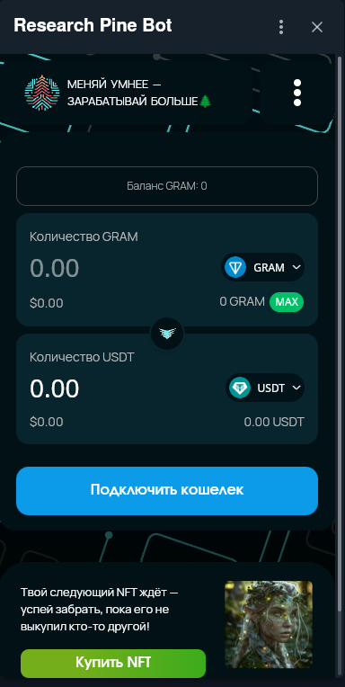</td>
  </tr>
</table>

**Что сделал:**
- Разработал **backend** платформы: API котировок, свопов и интеграцию с несколькими TON DEX (агрегация ликвидности с 4+ бирж)
- Построил **индесер блокчейна TON**: индексация транзакций, пулов и событий свопов для актуальных цен и продуктовой аналитики
- Спроектировал **Pathfinder** — движок поиска самого выгодного маршрута свопа, в т.ч. через промежуточные токены (multi-hop)
- Сделал ядро **DEX-агрегатора**: умный подбор курса, сравнение маршрутов, оптимизация свопа с учётом комиссий и проскальзывания
- Разработал **Telegram-бот** (RPine App): свопы токенов, подключение кошелька, **приватные пулы** с гарантированной ценой на момент старта сделки
- Поддерживал смежные продукты экосистемы: NFT-утилиты, мультисиг для команд и DAO

**Результат:** production DeFi-продукт на TON с умной маршрутизацией свопов, прозрачным ценообразованием и простой точкой входа через Telegram — от индексации on-chain данных до исполнения сделки в боте.

`Go` · `Python` · `PostgreSQL` · `Redis` · `TON` · `Telegram Bot API` · `Docker`

---

### Fullstack-разработчик — [Screener Exchange Spread](https://screener-spread.rpine.xyz/) · пет-проект · [RPine Lab](https://rpine.xyz/)
`01.2025 — настоящее время`

Скринер спредов и торговый бот для крипто-бирж (экосистема RPine).

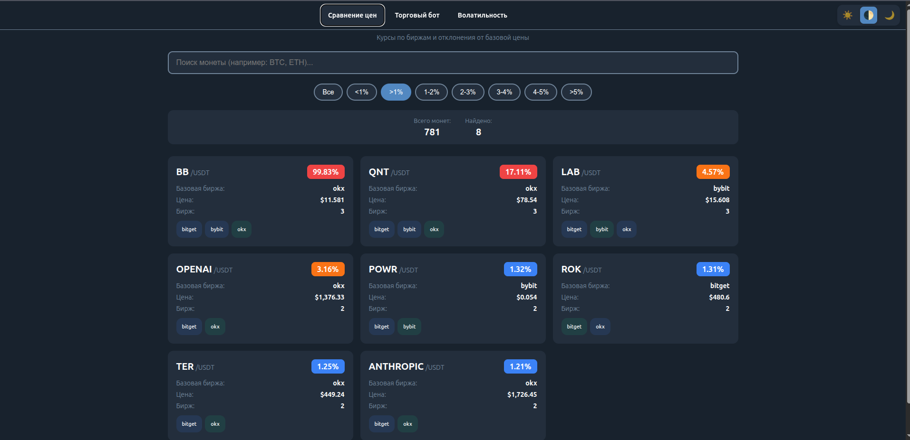

<table>
  <tr>
    <td width="50%">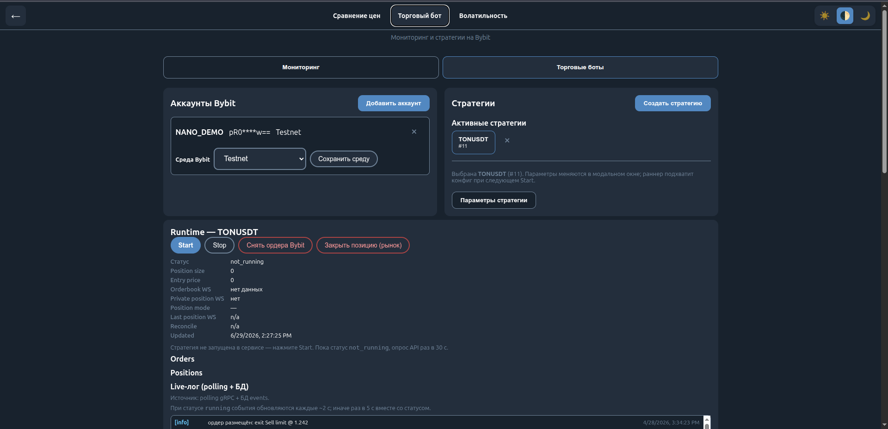</td>
    <td width="50%">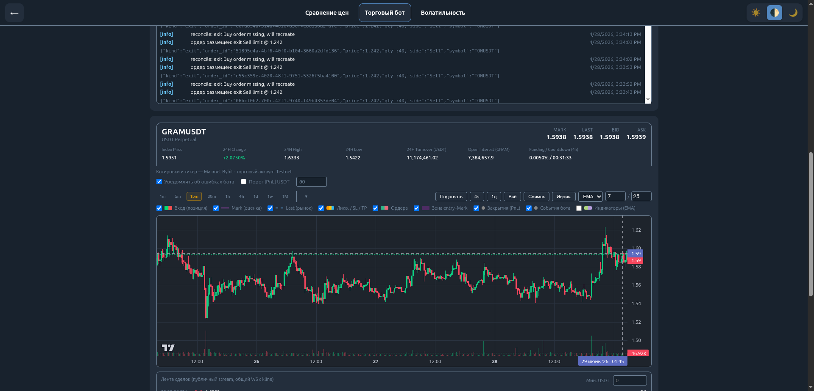</td>
  </tr>
</table>

**Что сделал:**
- Сбор котировок с нескольких бирж, расчёт **спредов** и арбитражных возможностей в реальном времени
- **Торговая логика** и уведомления о выгодных парах
- React-дашборд с live-данными
- Аутентификация через **Telegram**

**Результат:** инструмент мониторинга межбиржевых спредов и автоматизации торговых решений в одном интерфейсе.

`Go` · `Python` · `PostgreSQL` · `Redis` · `React` · `TypeScript` · `Docker`

---

### Backend-разработчик — [PhotoPingvin Bot](https://t.me/photopingvin_bot)
`02.2025 — настоящее время`

Telegram-бот для генерации фото, видео и музыки.

<table>
  <tr>
    <td width="50%">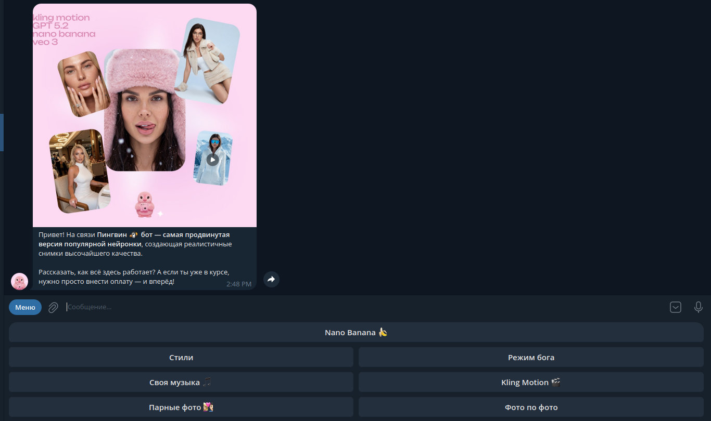</td>
    <td width="50%">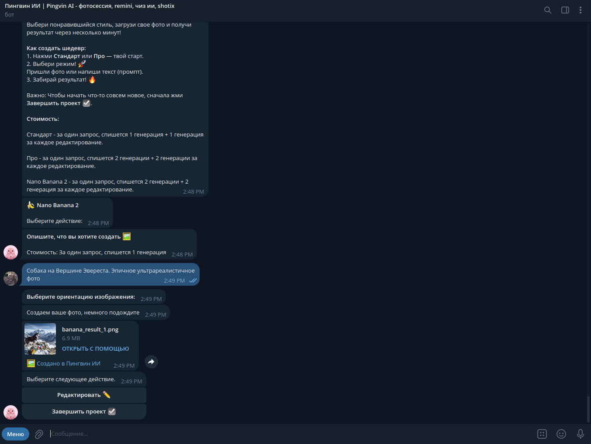</td>
  </tr>
</table>

**Что сделал:**
- Backend: **aiogram** + REST API на **Django Ninja**
- Асинхронный пайплайн генерации: **Celery + Celery Beat**, очереди на Redis
- Интеграция AI-провайдеров (**fal.ai**, **kie.ai** и др.) для фото, видео и аудио
- **Robokassa**: биллинг, баланс пользователя, оплата генераций

**Результат:** надёжная фоновая обработка долгих AI-задач с монетизацией через Telegram, без блокировки бота.

`Python` · `Django` · `Django Ninja` · `aiogram` · `Celery` · `Redis` · `PostgreSQL` · `Docker`

---

### Fullstack-разработчик — [Otty ASL](https://otty.go-rshok.ru)
`04.2026 — настоящее время`

EdTech-платформа для изучения американского жестового языка (ASL).

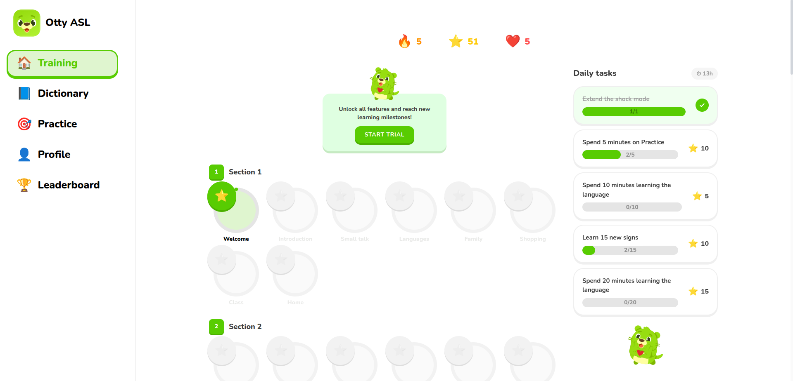

**Что сделал:**
- Геймифицированное обучение: **уроки, словарь, практика, таблица лидеров**
- Прогресс пользователя: стрики, ежедневные задания, система наград
- Монетизация по модели **подписки** и триала
- Fullstack: backend + React-фронтенд

**Результат:** интерактивная платформа изучения ASL с удержанием за счёт геймификации и понятным пользовательским путём.

`React` · `TypeScript` · `PostgreSQL` · `Docker`

---

### Backend-разработчик — [GetRealPrice](https://getrealprice.com)
`05.2022 — 05.2023`

B2B SaaS: мэтчинг товаров и мониторинг цен для ретейла и FMCG ([13 стран](https://getrealprice.com/)).

**Что сделал:**
- Backend на **Django** и **FastAPI**: REST API для B2B-клиентов
- Асинхронный **парсинг и мониторинг цен** через Celery-воркеры
- **Product matching** — сопоставление одного товара между маркетплейсами и магазинами
- Оптимизация PostgreSQL + Redis: очереди, кэширование частых запросов

**Результат:** масштабируемый backend для мониторинга цен и мэтчинга товаров, используемый enterprise-клиентами в нескольких странах.

`Python` · `Django` · `FastAPI` · `Celery` · `Redis` · `PostgreSQL` · `Docker`

---

### Fullstack-разработчик — [Pagga](https://github.com/devpunks20/pagga)
`11.2025 — 01.2026`

Web3 SaaS для крипто-компаний: договоры, подписи, казначейство, комплаенс.

**Что сделал:**
- Go-backend + дашборд на **Next.js**
- **AI-агенты** (Hub & Spoke): генерация SAFE, NDA и трудовых договоров через LLM
- **Электронные подписи**: email и кошелёк (MetaMask, WalletConnect) через **Privy**
- Казначейство: кошельки **Solana** + **Plaid** для фиатных счетов
- Telegram-бот для уведомлений и взаимодействия

**Результат:** all-in-one платформа для крипто-стартапов — от генерации договоров до подписания и финансовой аналитики в одном продукте.

`Go` · `Gin` · `GORM` · `PostgreSQL` · `Next.js` · `TypeScript` · `Privy` · `Plaid` · `Docker`

---

## 🎓 Образование

**Симферопольский политехнический колледж**  
Специальность: **Информационные системы и программирование** · Квалификация: **Программист**  
Среднее профессиональное образование

---

## 🎯 Хобби и увлечения

- **Дрессировка собак и зоопсихология** — занимаюсь дрессировкой своей собаки, изучаю зоопсихологию, окончил курс по дрессировке. Это учит терпению, системности и работе с обратной связью — тем же навыкам, что нужны в разработке.
- **Постоянное развитие в IT** — активно осваиваю современные подходы к разработке с AI (вайбкодинг): прохожу курсы по построению мультиагентных систем, оркестрации агентов, интеграции LLM в продукты. Слежу за практиками AI-assisted engineering и сразу применяю в работе.
- **Пет-проекты в разных областях** — регулярно делаю собственные продукты, чтобы пробовать новый стек и домены: real-time голосовой перевод (LiveVoice), переводчик на русский жестовый язык (SignSync), EdTech по ASL (Otty). Для меня это способ постоянно расти как инженеру, а не останавливаться на одном стеке.

---

**Открыт к интересным проектам и предложениям**

 

Обновлено: июль 2026

